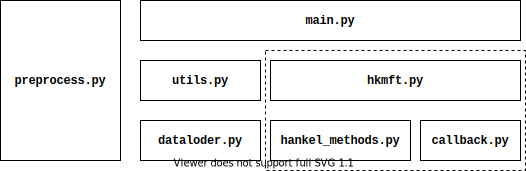
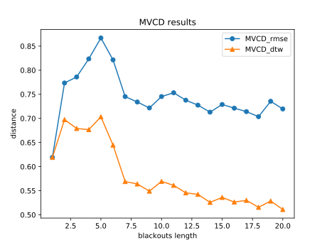
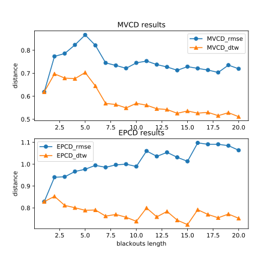
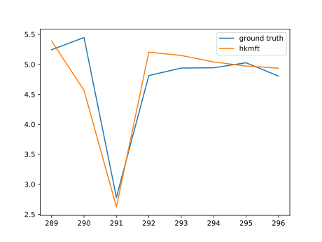
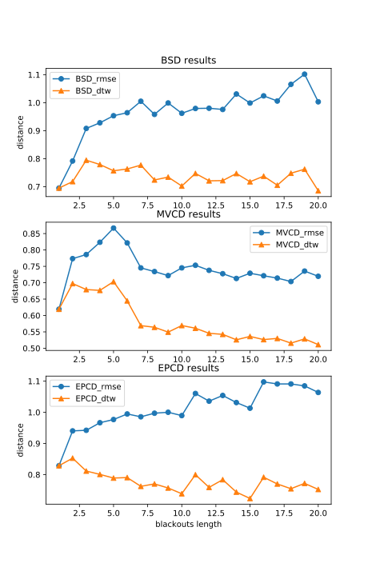

# HKMF-T

An implementation of the HKMF-T algorithm proposed in [Liang Wang, Simeng Wu, Tianheng Wu, Xianping Tao, and Jian Lu. HKMF-T: Recover from Blackouts in Tagged Time Series with Hankel Matrix Factorization. IEEE Transactions on Knowledge and Data Engineering (Early Access), 03 February 2020.](https://doi.org/10.1109/TKDE.2020.2971190) in Python, by Huiyu Jiang.

## 1. Description

HKMF-T decomposes the data sequence into two components: 1) an internal, slowly-varying smooth trend, and 2) external impacts indicated by the tag sequence. By transforming a partially observed data sequence into a corresponding Hankel matrix, we learn the above two components and estimate the missing values under a unified framework of Hankel matrix factorization.

In this repository, we pre-process three real-world datasets for experiments, and implemented four algorithms: **HKMF-T, MA-Tag, tag-mean, and linear interpolation** to evaluate the practical performance.

## 2. Software Structure

The file structure of the repository software is shown below.



The dash rectangle is the main method for recovering missing values in the time series. Other methods ([linear.py](linear.py), [ma_tag.py](ma_tag.py), [tag_mean.py](tag_mean.py)) are also implemented for comparison. 


## 3. Usage

### 3.1. Requirements

We use Python 3.6.8 during the development. And some packages are listed in [requirements.txt](requirements.txt) file, you can use install all packages with `pip install -r requirements.txt`.


### 3.2. Dataset

All datasets are generated by [preprocess.py](preprocess.py), the program [preprocess.py](preprocess.py) load raw dataset files from raw_data/ to generate `.csv` file, and these `.csv` files is saved in the directory dataset/ of this repository. So, you should skip this step, but remember that you can regenerate it via `python preprocess.py`.


### 3.3. Run

Run the HKMF-T algorithm using the following command:

#### 3.3.1. `single` mode

The `single`  mode allows one to specify the `DATASET`, and  the period of blackouts `[BLACKOUTS_BEGIN, BLACKOUTS_END)`. The algorithm recovers the missing values,  and plots the results.

Usage:

```shell
$ python main.py single <DATASET> <BLACKOUTS_BEGIN> <BLACKOUTS_END> --method=hkmft|tagmean|linear|matag [--dataset_norm=<DATASET_NORM>] [--max_epoch=<MAX_EPOCH>] [--train_eta=<TRAIN_ETA>] [--train_lambda_s=<TRAIN_LAMBDA_S>] [--train_lambda_o=<TRAIN_LAMBDA_O>] [--train_lambda_e=<TRAIN_LAMBDA_E>] [--train_stop_rate=<TRAIN_STOP_RATE>] [--train_converge_threshold=<TRAIN_CONVERGE_THRESHOLD>] [--is_show=True|False]
```

Help information:

```shell
$ python main.py single --help
NAME
    main.py single - HKMF-T single mode.

SYNOPSIS
    main.py single DATASET BLACKOUTS_BEGIN BLACKOUTS_END <flags>

DESCRIPTION
    HKMF-T single mode.

POSITIONAL ARGUMENTS
    DATASET
        must be in ['BSD', 'MVCD', 'EPCD'].
    BLACKOUTS_BEGIN
        blackouts begin index, closed.
    BLACKOUTS_END
        blackouts end index, open. [blackouts_begin, blackouts_end)

FLAGS
    --dataset_norm=DATASET_NORM
        data 0-dataset_norm normalize. (default 10.0)
    --method=METHOD
        must in ['hkmft', 'tagmean', 'linear', 'matag'].
    --max_epoch=MAX_EPOCH
        (hkmft) max epoch, if converge will be exit early. (default HKMFT_MAX_EPOCH=5000)
    --train_eta=TRAIN_ETA
        (hkmft) train parameter, η. (default 0.01)
    --train_lambda_s=TRAIN_LAMBDA_S
        (hkmft) train parameter, λ_s. (default 0.1)
    --train_lambda_o=TRAIN_LAMBDA_O
        (hkmft) train parameter, λ_o. (default 0.001)
    --train_lambda_e=TRAIN_LAMBDA_E
        (hkmft) train parameter, λ_e. (default 0.1)
    --train_stop_rate=TRAIN_STOP_RATE
        (hkmft) train parameter, s. (default 1.0)
    --train_converge_threshold=TRAIN_CONVERGE_THRESHOLD
        (hkmft) converge if diff less than threshold. (default 0.001)
    --is_show=IS_SHOW
        show result and ground truth in graphical. (default True)
```

* **EXAMPLE: Using HKMF-T to recover the period of blackouts [140, 143) in the BSD dataset (with sample outputs).**
```shell
$ python main.py single BSD 140 143 --method=hkmft
2021-09-26 13:37:47,443 epoch 1: 0.44472770922260274
2021-09-26 13:37:47,650 epoch 2: -0.012470998302217873
2021-09-26 13:37:47,870 epoch 3: -0.020016509716370996
...
2021-09-26 13:38:03,406 epoch 77: 0.004123814466889868
2021-09-26 13:38:03,413 Early stop in MaxDiffConvergeCallback.on_epoch().
gt: [[6.66169383 5.34771632 4.90475098]]
rs: [[5.41468418 5.2964191  4.95037934]]
rmse_score: 0.7210516409420187
dtw_score: 0.4479784095705286
dtw_score: 0.4479784095705286
```

#### 3.3.2. `enum` mode

The `enum` mode provides an easy way to experiment with a certain method on a specific dataset. Under the `enum` mode, the algorithm enumerates all periods of blackouts whose length is in the interval `BLACKOUTS_LENS = [x, y]`   The results will be recorded in a `.plk` file, which can be plotted using command `show`.

Usage:

```shell
$ python main.py enum <DATASET> <BLACKOUTS_LENS> --method=hkmft|tagmean|linear|matag [--step_len=STEP_LEN] [--dataset_norm=<DATASET_NORM>] [--max_epoch=<MAX_EPOCH>] [--train_eta=<TRAIN_ETA>] [--train_lambda_s=<TRAIN_LAMBDA_S>] [--train_lambda_o=<TRAIN_LAMBDA_O>] [--train_lambda_e=<TRAIN_LAMBDA_E>] [--train_stop_rate=<TRAIN_STOP_RATE>] [--train_converge_threshold=<TRAIN_CONVERGE_THRESHOLD>]
```

Help information:

```shell
$ python main.py enum --help
NAME
    main.py enum - HKMF-T enumerate mode.

SYNOPSIS
    main.py enum DATASET BLACKOUTS_LENS <flags>

DESCRIPTION
    HKMF-T enumerate mode.

POSITIONAL ARGUMENTS
    DATASET
        must in ['BSD', 'MVCD', 'EPCD'].
    BLACKOUTS_LENS
        the interval [x, y] of blackout lengths, given in the form of x-y, and x <= y.

FLAGS
    --step_len=STEP_LEN
        blackouts begin step length. (default 1)
    --dataset_norm=DATASET_NORM
        data 0-dataset_norm normalize. (default 10.0)
    --method=METHOD
        must in ['hkmft', 'tagmean', 'linear', 'matag'].
    --max_epoch=MAX_EPOCH
        (hkmft) max epoch, if converge will be exit early. (default HKMFT_MAX_EPOCH=5000)
    --train_eta=TRAIN_ETA
        (hkmft) train parameter, η. (default 0.01)
    --train_lambda_s=TRAIN_LAMBDA_S
        (hkmft) train parameter, λ_s. (default 0.1)
    --train_lambda_o=TRAIN_LAMBDA_O
        (hkmft) train parameter, λ_o. (default 0.001)
    --train_lambda_e=TRAIN_LAMBDA_E
        (hkmft) train parameter, λ_e. (default 0.1)
    --train_stop_rate=TRAIN_STOP_RATE
        (hkmft) train parameter, s. (default 1.0)
    --train_converge_threshold=TRAIN_CONVERGE_THRESHOLD
        (hkmft) converge if diff less than threshold. (default 0.001)
```

* **EXAMPLE: We enumerate the blackouts with length from 1 to 20. And for each length, we enumerate all periods of blackouts from the beginning to the end of the dataset.**
```shell
$ python main.py enum MVCD 1-20 --max_epoch=5000 --method=hkmft
[Parallel(n_jobs=35)]: Using backend LokyBackend with 35 concurrent workers.
[Parallel(n_jobs=35)]: Done 130 tasks      | elapsed:   13.3s
[Parallel(n_jobs=35)]: Done 380 tasks      | elapsed:   38.0s
[Parallel(n_jobs=35)]: Done 730 tasks      | elapsed:  1.2min
[Parallel(n_jobs=35)]: Done 1180 tasks      | elapsed:  2.2min
[Parallel(n_jobs=35)]: Done 1730 tasks      | elapsed:  5.7min
[Parallel(n_jobs=35)]: Done 2380 tasks      | elapsed: 14.2min
[Parallel(n_jobs=35)]: Done 3130 tasks      | elapsed: 36.2min
[Parallel(n_jobs=35)]: Done 3911 out of 3911 | elapsed: 131.5min finished
```

After finished, we will get a file looks like `results_MVCD_20210919_123936.plk`.

#### 3.3.3. `show` command

The `show` command provides a way to plot the experimental results of the files generated by the `enum` command.

Usage:

```shell
$ python main.py show <flags> [RESULT_FILES]...
```

Help information:

```shell
NAME
    main.py show

SYNOPSIS
    main.py show <flags> [RESULT_FILES]...

POSITIONAL ARGUMENTS
    RESULT_FILES
        result files saved in plk format. If flags --dataset, --blackouts_begin, and --blackouts_len are set, the program shows the detailed recovering results for a single period. Otherwise, it shows an overview of the recovering errors (distances) with respect to the length of blackouts.

FLAGS
    --dataset=DATASET
        must in ['BSD', 'MVCD', 'EPCD'].
    --blackouts_begin=BLACKOUTS_BEGIN
        blackouts begin index, closed.
    --blackouts_len=BLACKOUTS_LEN
        blackouts length, must int.
    --no_rmse=NO_RMSE
        do not show rmse.
    --no_dtw=NO_DTW
        do not show dtw.
    --recalculate=RECALCULATE
        recalculate metrics then show it.
```

* **EXAMPLE: Plot the result of MVCD.**
```shell
$ python main.py show results_MVCD_20210919_123936.plk
MVCD RMSE: [0.6191276670523673, 0.7735208095992376, 0.7859989202023414, 0.823494511025023, 0.8668712785601177, 0.8214691213063982, 0.7452497810864422, 0.7340520053544389, 0.721729650690604, 0.7453394221700954, 0.7532229481806109, 0.7378135312933818, 0.7275439905232487, 0.7129905019498933, 0.728898941288801, 0.7212641670291999, 0.714092196977668, 0.7035932015124342, 0.7355189930511586, 0.719624085360777]

MVCD DTW: [0.6191276670523673, 0.6974403296462471, 0.6790974478588461, 0.6766768881690123, 0.7032492579019645, 0.6446347274545063, 0.5689898775860225, 0.5640467103136252, 0.5492038767197924, 0.569327700423323, 0.5611343573796325, 0.5455780688899313, 0.5424255978508898, 0.5258379168036854, 0.5360799073703404, 0.5264425185541132, 0.5300044178708435, 0.5156170156556387, 0.5286018389124276, 0.5110718086096868]
```




* **EXAMPLE: Plot the result of MVCD and EPCD.**
```shell
$ python main.py show results_MVCD_20210919_123936.plk results_EPCD_20210918_013419.plk
MVCD RMSE: [0.6191276670523673, 0.7735208095992376, 0.7859989202023414, 0.823494511025023, 0.8668712785601177, 0.8214691213063982, 0.7452497810864422, 0.7340520053544389, 0.721729650690604, 0.7453394221700954, 0.7532229481806109, 0.7378135312933818, 0.7275439905232487, 0.7129905019498933, 0.728898941288801, 0.7212641670291999, 0.714092196977668, 0.7035932015124342, 0.7355189930511586, 0.719624085360777]

MVCD DTW: [0.6191276670523673, 0.6974403296462471, 0.6790974478588461, 0.6766768881690123, 0.7032492579019645, 0.6446347274545063, 0.5689898775860225, 0.5640467103136252, 0.5492038767197924, 0.569327700423323, 0.5611343573796325, 0.5455780688899313, 0.5424255978508898, 0.5258379168036854, 0.5360799073703404, 0.5264425185541132, 0.5300044178708435, 0.5156170156556387, 0.5286018389124276, 0.5110718086096868]

EPCD RMSE: [0.8286387624071885, 0.9403570286841203, 0.9422783160579564, 0.9665432003312795, 0.9768020114813012, 0.9946780442924974, 0.9855784343207928, 0.9970777682031605, 1.000115843082804, 0.9894364537174306, 1.060434697506872, 1.035753401514603, 1.0540776082039407, 1.031319380293505, 1.0131756711065953, 1.0975317194633971, 1.0910216643560544, 1.091026090734122, 1.0847412557705405, 1.0637043976251697]

EPCD DTW: [0.8286387624071885, 0.8528081529228628, 0.811396680842621, 0.8007392880130553, 0.7889736595259933, 0.7905164978508458, 0.7623855036523295, 0.7701577888566895, 0.7570934854105017, 0.7386498454208449, 0.799714744530505, 0.7590689508021314, 0.7838106521584618, 0.7439121073921209, 0.7233915130599358, 0.7916391054185298, 0.7699772163278097, 0.7547759160819112, 0.7718995978164962, 0.7524404141309086]
```



* **EXAMPLE: Recover the blackouts during [289, 397) of the BSD dataset, and plot the result.**

```shell
$ python main.py single BSD 289 297 --method=kmft --train_converge_threshold=0.0
```



Note: the above results are obtained by forcing HKMF-T to iterate 5000 rounds by setting `--train_converge_threshold=0.0`.


## 4. HKMF-T results

All results are saved to [results.pdf](./results_0919.pdf), including the results of the four methods HKMF-T, MA-Tag, tag-mean, and linear, on the three datasets including BSD, MVCD, and EPCD. The following figures show the performance of HKMF-T on the three datasets.


